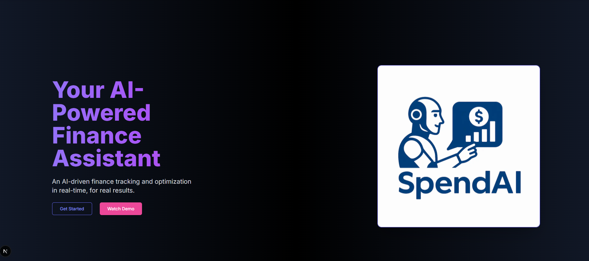

# 🚀 SpendAI – AI-Powered Finance Management Platform  

  

> **Manage your expenses smarter with AI!**  
SpendAI is an **AI-powered finance management platform** that helps you **track expenses, scan receipts using AI, and search receipts using Generative AI**.  
Built with **Next.js**, **Supabase**, **LangChain**, **Pinecone**, and **Gemini API**.

---

## 🌟 **Features**
✅ **Finance Management Dashboard**  
- Add expenses manually or by scanning receipts.  
- Real-time expense categorization & summary charts.  
- Secure data storage with Supabase.  

✅ **Smart Receipt Scan (AI-powered OCR)**  
- Upload a receipt → AI extracts amount, date, vendor.  
- Data auto-added to expense tracker (Gemini API + OCR).  

✅ **Smart Receipt Search (Generative AI + RAG)**  
- Search receipts using natural language:  
  *“Show me the coffee receipt from last week”*.  
- Uses **LangChain + Pinecone** for semantic search.  

---

## 🛠 **Tech Stack**
<p align="center">


</p>

---

## 📸 **Screenshots**
| Dashboard | Smart Receipt Scan | AI Receipt Search |
|-----------|--------------------|-------------------|
|  |  |  |

---

## ⚡ **Installation**
```bash
# Clone the repo
git clone https://github.com/your-username/spend-ai.git

# Navigate to project
cd spend-ai

# Install dependencies
npm install

# Setup environment variables in .env.local
NEXT_PUBLIC_SUPABASE_URL=your_supabase_url
NEXT_PUBLIC_SUPABASE_ANON_KEY=your_supabase_key
GEMINI_API_KEY=your_gemini_api_key
PINECONE_API_KEY=your_pinecone_api_key

# Run the app
npm run dev

